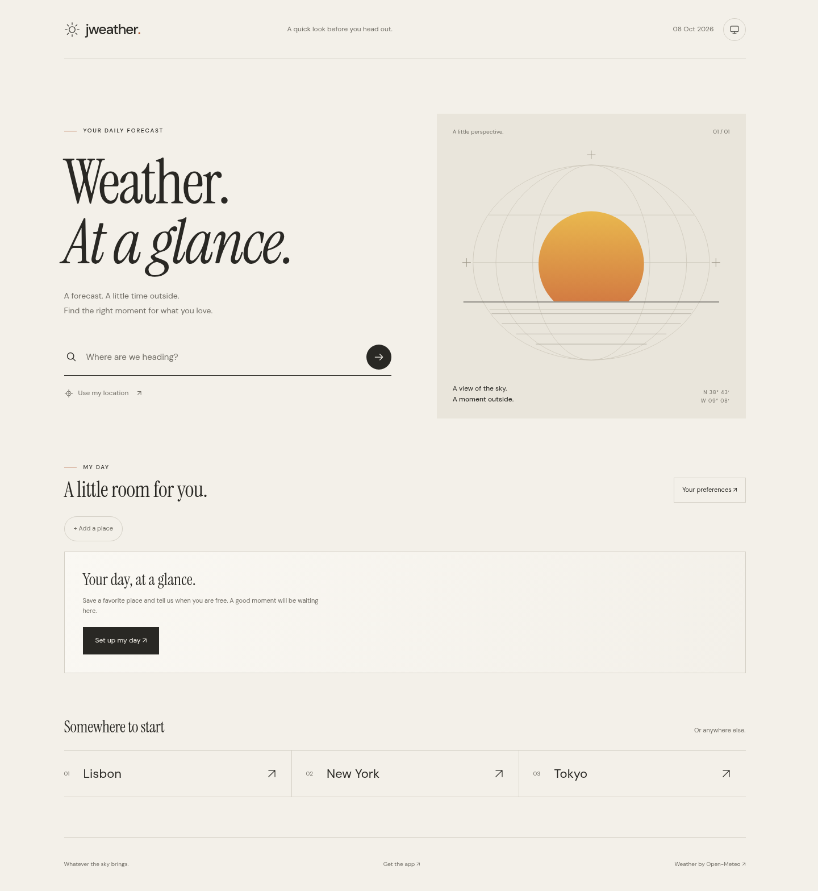
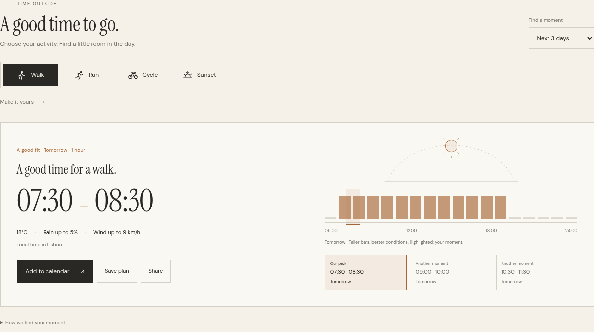
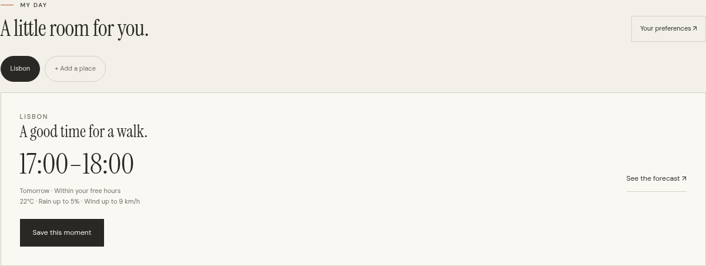
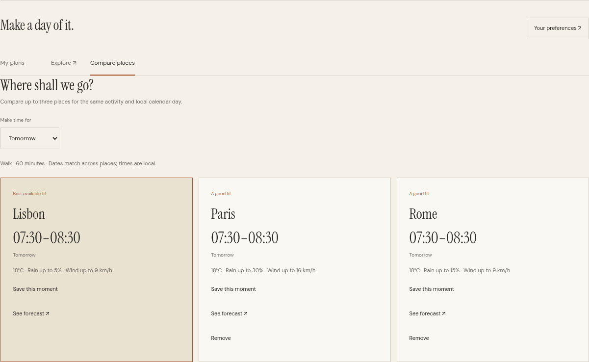
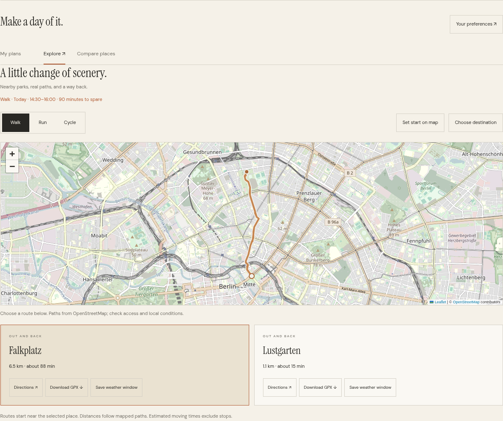
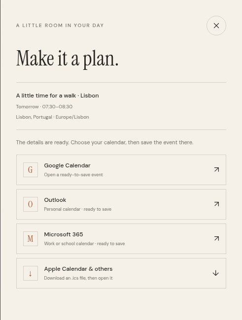
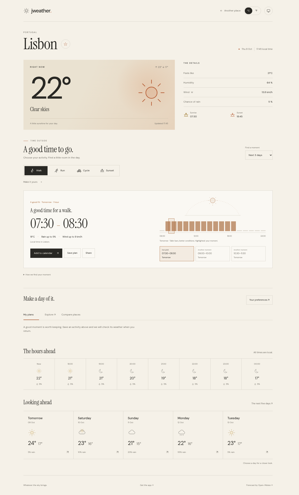
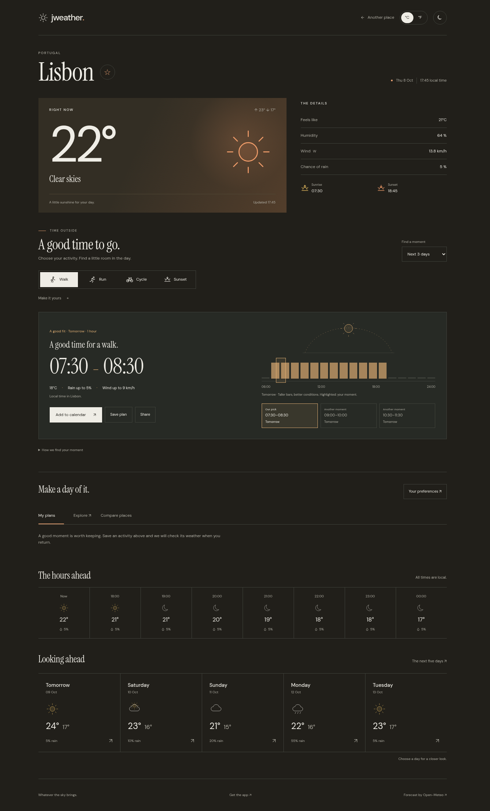
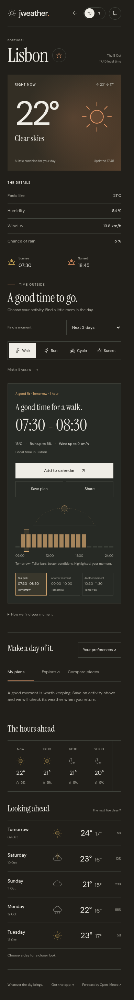

<div align="center">

# jweather.

Weather at a glance. A little time outside.

[Open Jweather ↗](https://jayden-ff.github.io/Jweather/)

</div>



A forecast for wherever you are. Search a city or use your location, then find a good moment for a walk, a run, a ride or the last light of the day.

The interface pairs warm neutrals with amber sunlight and a little orange at sunset. Light and dark appearances follow your system or your choice. Colours and small, quiet animations respond to the weather.



## A little time outside

Choose **Walk**, **Run**, **Cycle** or **Sunset**. Jweather compares hourly conditions and suggests up to three distinct moments over the next three days. Change the duration or time of day, or focus on today or tomorrow. Each suggestion shows its temperature, maximum rain chance and wind.

Suggestions use the whole activity window, daylight, rain, wind, gusts, temperature and UV. Cycling has a stricter wind limit; sunset also considers cloud cover. Uncomfortable conditions or missing readings produce an honest empty state. These are forecasts, so check conditions before heading out.

**Add to calendar** prepares the activity, place and times for Google Calendar, Outlook or Microsoft 365. An ICS file works with Apple Calendar and other calendar apps. Calendar links open an event draft; you save it in the destination app.

Optional Google and Microsoft connections can create the event directly after account consent. They need public OAuth application IDs in [calendar-config.js](calendar-config.js). [Calendar setup](docs/calendars.md) explains the registrations and exact callback URLs. No client secret or backend is needed. The default site works immediately with calendar links and ICS.

## Make a day of it

**My day** starts with your favorite places, preferred activity and free hours. A personal suggestion waits on the home page. Save a moment and find it under **My plans**; Jweather checks its weather when you return. If conditions change, review a better time before moving the plan. A connected calendar can update its linked event after your confirmation.



**Compare places** puts up to three destinations beside each other for tomorrow, the weekend or the next three days. Suggestions use the same activity and local calendar dates. Each one shows the conditions behind it; unavailable or offline forecasts stay out of the ranking.



**Explore** finds nearby parks and mapped out-and-back routes for walking, running or cycling. Choose a start or destination on the map, see the actual path and distance, then open directions or download the track as GPX. Walking and cycling use different routing profiles; running times use an estimated 9 km/h pace. A suitable weather window can be saved alongside your plans.



**Share** sends a link with the place, activity and absolute start time. Someone else can open it, check the forecast and save the same moment. Calendar connections and event IDs stay private.

## Keep it close

Use **Get the app** to install Jweather where your browser supports it. After a first online visit, the app and up to twenty loaded forecasts are available offline. Saved conditions carry their original download time; new recommendations and comparisons need a fresh connection. Maps and route planning need internet access.

Places, preferences and saved plans stay on this device, in this browser. There is no account or cross-device sync. [How plans, maps and offline access work](docs/plans.md).

<details>
<summary>Make it a plan</summary>
<br>

</details>

## The forecast

<table>
<tr><th>Light</th><th>Dark</th></tr>
<tr>
<td></td>
<td></td>
</tr>
</table>

<details>
<summary>On a smaller screen</summary>
<br>

</details>

*Screenshots show the actual interface with example forecast data.*

- Current temperature, feels-like temperature, humidity and wind
- Eight hours ahead, five days ahead, and a closer look at each day
- Sunrise, sunset, rain probability and precipitation
- Celsius or Fahrenheit, remembered places, and light or dark appearance
- Activity windows, personal preferences and calendar export
- Favorite places, saved plans, destination comparison and shareable moments
- Maps, walking and cycling routes, GPX downloads and offline forecasts
- Keyboard navigation, mobile layouts and reduced-motion support

Everything runs in the browser. Forecasts need no API key, framework or build step. Location access is requested only when you choose **Use my location**. Preferences and recent places stay in your browser. Calendar access tokens stay in memory and are discarded on reload; connecting a calendar never happens until you choose it.

## Development

Serve the repository with any static web server:

```sh
python3 -m http.server 8000
```

Or, with Node.js 20 or newer:

```sh
npm run dev
```

The Node server uses port 8080 and the `/Jweather/` project path. It does not require installing npm dependencies. Geolocation needs HTTPS, except on localhost.

## Checks and screenshots

```sh
npm ci
npx playwright install chromium
npm test
npm run screenshots
```

To use an existing Chromium installation:

```sh
PLAYWRIGHT_CHROMIUM_EXECUTABLE=/usr/bin/chromium npm test
PLAYWRIGHT_CHROMIUM_EXECUTABLE=/usr/bin/chromium npm run screenshots
```

Tests cover recommendations, personal hours, changed plans, comparison, sharing, route geometry, offline caching, search, units, themes and mobile layouts. Google consent and Microsoft's PKCE flow use simulated provider responses, including denial, invalid callback states and updates to linked events. Real account access requires configured app registrations. Interface screenshots use repeatable example forecasts; the map example uses saved OpenStreetMap route data.

To refresh the map screenshot as well, set `JWEATHER_SCREENSHOT_MAP=1`. This fetches only tiles displayed in the example view, with normal TLS verification. Other screenshots need no external service.

## GitHub Pages

In **Settings → Pages**, choose **Deploy from a branch**, select your branch and **/ (root)**, then save. No build is needed. Relative asset paths support both project sites and custom domains; `.nojekyll` keeps deployment static.

Forecasts can be linked directly:

```text
weather.html?lat=38.7223&lon=-9.1393&name=Lisbon&country=Portugal
```

Existing links with `lat`, `lon` and `name` continue to work.

The manifest and service worker use relative paths, including the `/Jweather/` project prefix. When changing offline assets for a later release, bump `VERSION` in [service-worker.js](service-worker.js) and the HTML asset versions. Existing installations offer **Update Jweather** once the new shell is ready; personal data survives the update.

## Data and credits

Weather and place search: [Open-Meteo](https://open-meteo.com/), subject to its [terms](https://open-meteo.com/en/terms). Times use the selected place's timezone. Daily rain probability is the day's maximum; missing optional readings appear as `—`. Weather updates when you open or reload the forecast. Sunrise and sunset accents use the forecast's local time.

Maps and paths: [OpenStreetMap contributors](https://www.openstreetmap.org/copyright), under ODbL. Parks: [Overpass](https://overpass-api.de/), with bounded [Nominatim](https://nominatim.org/) category search as a fallback. Routes: [FOSSGIS / OSRM](https://routing.openstreetmap.de/). Route requests are queued below one per second, and results are reused during the visit. [Leaflet 1.9.4](https://leafletjs.com/) is served locally with its [BSD license](assets/vendor/leaflet/LICENSE.txt). Tiles are loaded only for the open map; none are downloaded for offline use.

Type: **DM Sans** and **Instrument Serif**, served locally under the [SIL Open Font License](assets/fonts/). Application: [Apache 2.0](LICENSE).
